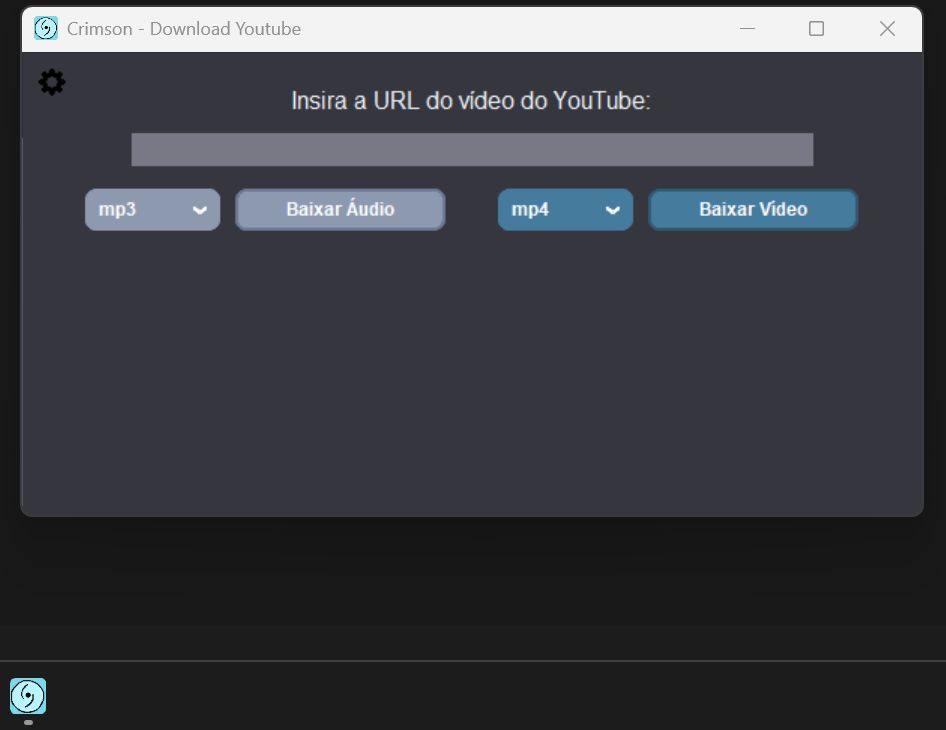
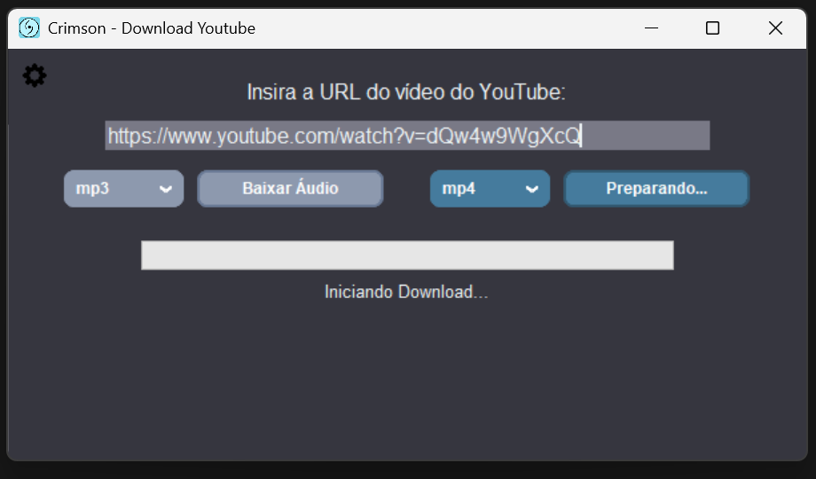
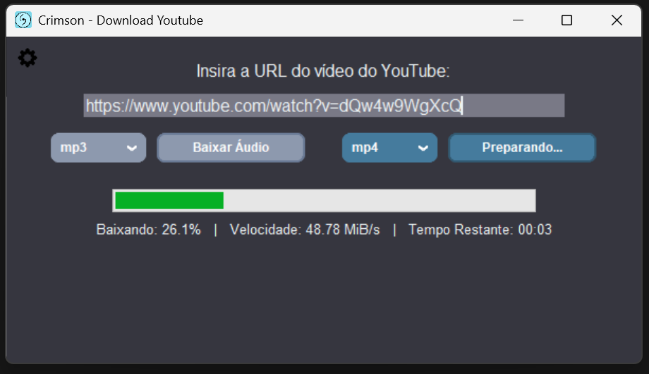
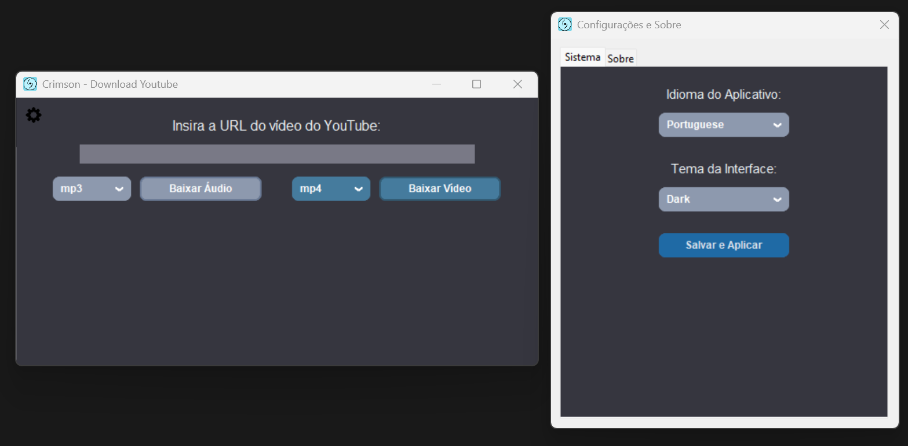
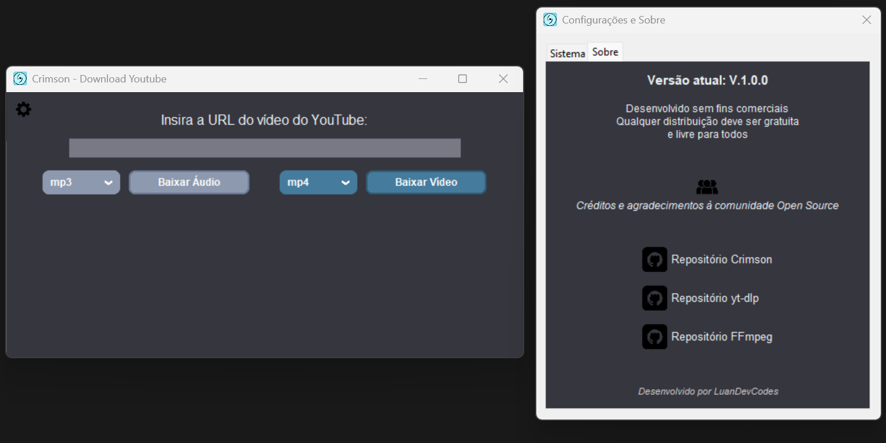

<h1 align="center">
   
  Projeto Crimson - Interface de Download do YouTube
</h1>

## = Descrição do Projeto
O Crimson é uma aplicação desenvolvida em Python com uma interface gráfica nativa (Tkinter) criada para facilitar e automatizar o download de vídeos e áudios do YouTube. O projeto encapsula o poder da biblioteca `yt-dlp` e a capacidade de processamento de mídia do `FFmpeg` por trás de uma tela amigável e responsiva. A aplicação também lida de forma autônoma com atualizações de segurança internas, esquivando-se ativamente do erro "403: Forbidden" imposto por constantes mudanças no algoritmo do YouTube. A ideia do projeto nasceu de uma necessidade pessoal minha e da ideia de facilitar esse tipo situação.

## Δ Bibliotecas e Ferramentas
- **Python 3.x**
- **yt-dlp**: Motor principal responsável por buscar e realizar a extração bruta das mídias.
- **Tkinter & CustomTkinter**: Base nativa somada à extensão moderna para construir uma interface, dropdowns responsivos, cantos arredondados e design Frontend "Flat".
- **Threading**: Módulo responsável por criar rotinas em segundo plano, evitando o congelamento da interface gráfica (mainloop) durante o demorado processo de download em alguns casos.
- **json & os**: Orquestradas em conjunto para lidar com a pasta oficial de configurações do usuário (`%LOCALAPPDATA%`) e salvar o estado da aplicação via memória persistente.
- **urllib.request & zipfile**: Usados para orquestrar o motor modular, dispensando o uso do instalador de pacotes global do sistema e agindo como ponte de download direto com a source master do `yt-dlp`.
- **subprocess & re**: Utilizados para operar ferramentas (como invocar a barra inicial) e limpar os logs poluídos da CLI bruta em tempo real via Expressões Regulares (Regex).
- **webbrowser**: Módulo nativo do Python usado para transformar as logos dos repositórios no Painel de Créditos em botões clicáveis de redirecionamento.

## § Funcionalidades
- **Download Flexível e Descomplicado**: Escolha entre baixar apenas áudio ou vídeo (com as qualidades mescladas perfeitamente) através de dropdowns visuais (`mp3`, `mp4`, `mkv`, etc).
- **Processamento Assíncrono (Zero-Freeze)**: As operações de download pesado e gravação de arquivos não disputam espaço com a renderização visual. Tudo ocorre em *threads* separadas, com a barra de progresso, velocidade e ETA atualizando de forma lisa e constante na thread principal.
- **Download reformulado**: Implementação de uma divisão inteligente de rede. O sistema corta a requisição do YouTube em blocos (`http_chunk_size`) e abre 5 conexões de download simultâneas, bypassando o estrangulador de velocidade moderno do YouTube e voando nas taxas de transferência.
- **Blindagem do Auto-Update Silencioso**: No exato momento em que o aplicativo é inicializado, uma tela de loading bloqueia o uso enquanto a thread secundária verifica e aplica silenciosamente a última versão do `yt-dlp`. Isso blinda o código contra depreciação contínua.
- **Conversão por Fator Externo (FFmpeg)**: O yt-dlp extrai nativamente os vídeos do YouTube na melhor qualidade, mas separadamente da faixa de áudio de alta resolução. O Crimson aciona o FFmpeg de maneira integrada para mesclar essas duas camadas ou convertê-las para formatos específicos.
- **Internacionalização em Tempo Real (PT-BR / EN)**: O sistema inteiro possui um "dicionário" de idiomas em memória. Através de um *Callback* no Painel de Configurações, o usuário pode alterar o idioma e ver todos os textos, pop-ups, barra de progresso e informações de velocidade reagirem e mudarem instantaneamente na tela mãe sem que a aplicação precise reiniciar.
- **Identidade Visual e Temas Dinâmicos**: O aplicativo suporta variações completas de tema (Matcha, Egg e Dark) com paletas curadas em tons pastéis. A interface, os menus flutuantes e as marcas d'água são coloridos durante a troca, sem precisar recarregar a tela.
- **Persistência de Dados e Roteamento Seguro**: O aplicativo memoriza as preferências do usuário (como o seu tema preferido e idioma) salvando um `.json` seguro na rota oculta do `AppData`. Além disso, para evitar confusão de arquivos na raiz do executável, as mídias baixadas não precisam mais de rota estipulada e caem nativamente na pasta de `Downloads` original do Sistema Operacional do usuário.
- **Painel Modular e Créditos**: Uma janela flutuante baseada em "Abas de Notebook", criada para abrigar configurações globais de sistema e um painel de honra à comunidade Open Source, detalhando as ferramentas base do software e seus respectivos repositórios oficiais.

## ❏ Interface Visual
> [!NOTE]
> As capturas de tela abaixo retratam a evolução do projeto, servindo como um registro visual, o software evoluiu de um escopo desenhado no Tkinter raiz (Beta) e foi totalmente remodelado usando CustomTkinter com o tempo, adotando novos ícones, cantos arredondados, feedbacks visuais (hover) e novas paletas de temas.

### → Release 1.0 (Atual)

  
<b>Visão Geral da Nova Interface (Modo Escuro / Temas Pastéis)</b>

  
  
    
  
  
<b>Download Assíncrono com Atualização em Tempo Real</b>

  
  &nbsp;
  

    

  
<b>Painel de Configurações Dinâmicas e Créditos</b>

  
  &nbsp;
  

 

### ← Versão Beta (Legado e Protótipo)

  
  &nbsp;
  

 

## + Guia de Uso e Configuração de Ambiente
Caso você venha a clonar este repositório para inspecionar, executar ou modificar o código através de uma IDE local, existem alguns pré-requisitos fundamentais para o funcionamento.

O Crimson não confia na instalação global das dependências no computador do usuário. Ele exige e rastreia o **FFmpeg** em um escopo totalmente local (na mesma pasta do código):

1. **Instale as Bibliotecas**: Certifique-se de instalar as bibliotecas do projeto, as versões usadas podem ser consultadas no arquivo de requerimentos do repositório.
2. **Setup do FFmpeg**: Crie uma pasta chamada `ffmpeg` na raiz deste projeto (onde o arquivo `Crimson.py` está localizado).
3. Baixe os binários de execução do FFmpeg (.exe) e aloque-os dentro dessa pasta. Dica: jogue os três arquivos dentro da pasta (ffmpeg.exe, ffplay.exe e ffprobe.exe), eles normalmente são pesados e um exemplo do download correto seria pelo nome abaixo (lembrando que tudo depende do ambiente de execução): "ffmpeg-master-latest-win64-gpl"
**[ » Acessar Repositório do FFmpeg Builds ](https://github.com/BtbN/FFmpeg-Builds/releases)**

4. Ao rodar o código pela IDE, o Python irá ler o caminho relativo dessa pasta de forma inteligente e injetar ele temporariamente nas Variáveis de Ambiente (`os.environ["PATH"]`).

## ° Tecnologias Avançadas de Bypass e Otimização
O Crimson passou por otimização no seu núcleo para resolver gargalos históricos de bloqueios anti-bot, uso excessivo de CPU e falhas de bibliotecas engessadas:
- **Bypass Anônimo (Apple Vision Pro & Android VR)**: com o versionamento de segurança agressivo (`--pre` Nightly), o Crimson acessa endpoints experimentais do YouTube. Ele simula chamadas em nome dos óculos de realidade virtual da Apple e do Android, que recebem fluxos de dados sem limitação de cookies e qualidade (1080p e 4K puros).
- **Uso reduzido de CPU**: Substituí os conversores de vídeo tradicionais (que re-renderizam os vídeos e sobrecarregam o processador em 100%), programa exige do YouTube apenas formatos de vídeo compatíveis com a extensão desejada (ex: H.264 para MP4). Assim, o FFmpeg apenas "cola" o vídeo e o áudio em questão de segundos e gastando muito menos recursos do computador.
- **Injeção Modular de Motor de Download**: Para garantir que o programa poderá ser compilado em um `.exe` standalone e ainda assim consiga se atualizar (sem depender do instalador nativo do python na máquina), o Crimson faz um parse direto com a base do github. Usando apenas bibliotecas puras, ele baixa a Source Code Master e manipula o radar interno do Python (`sys.path.insert`) para forçá-lo a compilar com o novo pacote na memória.

## • Arquitetura de Compilação (O Teste de "Releases")
O Crimson nasce não só como uma utilidade do dia a dia, mas também com o papel de ser um **projeto de homologação para o sistema de "Releases" do GitHub**.

A arquitetura final do projeto tem como objetivo compilar (via **PyInstaller**) tanto as lógicas do Python quanto os pesados binários do `FFmpeg` na construção de um único artefato: um `.exe` portátil e autossuficiente. Esse pacote encapsulado será testado nas publicações de Release do GitHub, servindo como modelo para que qualquer pessoa consiga baixar o software de forma limpa e no melhor conceito "Plug and Play".

---

> **Agradecimentos e mensagem final**  
> Conforme eu for atualizando/melhorando seu funcionamento, fornecerei novas versões de acordo com a necessidade. Deixo em evidência que realizei a criação do projeto com ajuda de inteligências artifíciais (AI), buscando melhoria contínua e novos aprendizados, mas sem omitir seu uso na estruturação do projeto e ajuda na codificação. 
>   
> Meus mais profundos agradecimentos a todos os desenvolvedores e às comunidades *Open Source* que fornecem de forma livre as ferramentas usadas (`yt-dlp`, `FFmpeg`) que tornaram a criação deste programa possível.

 

**Desenvolvido por Luan**  
*Ad Infinitum*